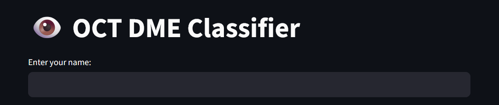
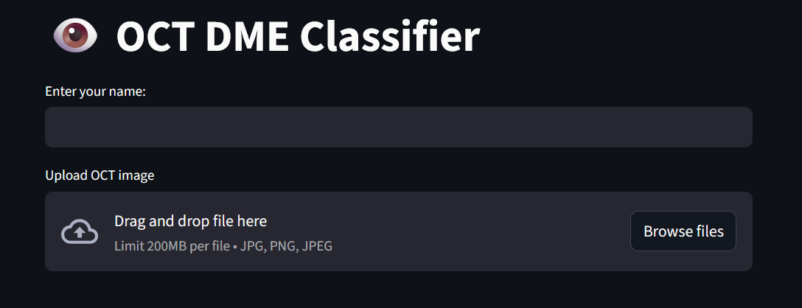
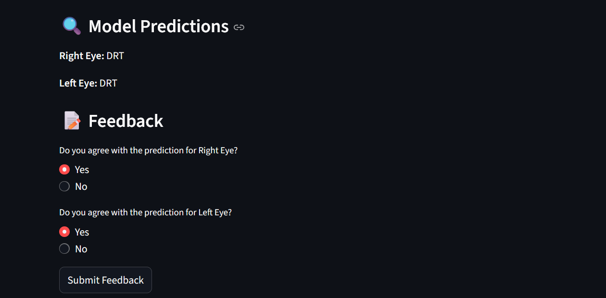

# 👁️ OCT DME Classifier

An interactive web application to **detect Diabetic Macular Edema (DME)** from OCT (Optical Coherence Tomography) images of the eye using a deep learning model. Designed for clinical relevance and ease of use.

---

## 🚀 Project Motivation

Diabetic Macular Edema (DME) is one of the leading causes of vision loss among diabetic patients. Early diagnosis and treatment can **prevent permanent vision damage**. However, manual screening of OCT scans can be time-consuming and subject to human error.

This app aims to:

- **Automate** the classification of OCT reports into categories: CME, DRT, SRD, NOR.
- **Engage users** (e.g., ophthalmologists or technicians) by allowing feedback on predictions.
- **Store user and prediction data** for continual system improvement.

---

## 🧠 How it Works

This application is powered by a **YOLOv11-based image classification model** fine-tuned on multiple DME categories. It's built using **Streamlit** for the frontend and **Python** for backend processing and logging.

---

## 🧪 Try it Out! 

## Here is the link for accessing the app
https://huggingface.co/spaces/saisyam1729/oct-dme-classifier

Follow these steps:

### 1️⃣ Enter Your Name  
Your name will be stored as part of the session for logging purposes.



---

### 2️⃣ Upload Patient OCT Report  
Only standard OCT images are supported. A sample is shown below.




---

### 3️⃣ Wait for Classification  
The system will classify **left** and **right** eye images into appropriate DME categories.


---

### 4️⃣ Submit Feedback  
You can agree or disagree with the system's predictions for each eye.



---

## 📂 Logs and Learning

- All interactions (user name, prediction result, feedback) are **logged** securely.
- These logs can be used for future **model improvement**, retraining, and performance audits.

---

## 📌 Tech Stack

- `Python`
- `Streamlit`
- `YOLOv8n-cls`
- `OpenCV`, `Pandas`, `NumPy`
- `Matplotlib` (optional for visual analysis)

---

## 🛠️ Setup Instructions

1. Clone the repo:
    ```bash
    git clone https://github.com/saisyam-1729/OCT-DME-Classifier-App.git
    cd OCT-DME-Classifier-App
    ```

2. Install dependencies:
    ```bash
    pip install -r requirements.txt
    ```

3. Run the app:
    ```bash
    streamlit run app.py
    ```

---

## 📄 License

This project is distributed under an **Other** license — please refer to the repository for more details.

---

## 🙋‍♂️ About the Author

Made with ❤️ by Sai Syam — feel free to reach out or contribute to the project!

☎️Phone: +91 7702161829
✉️email: psaisyam@gmail.com

---

